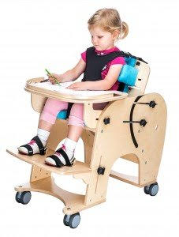
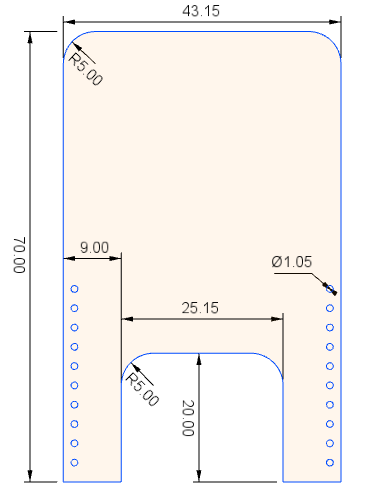
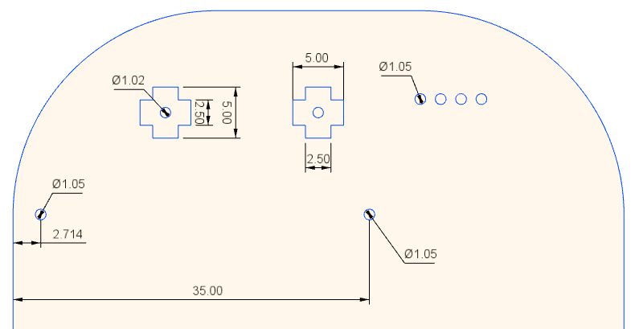
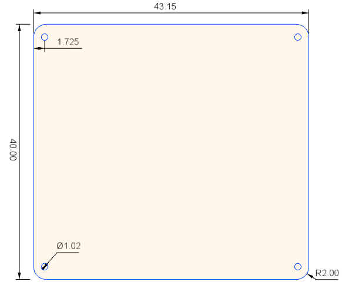
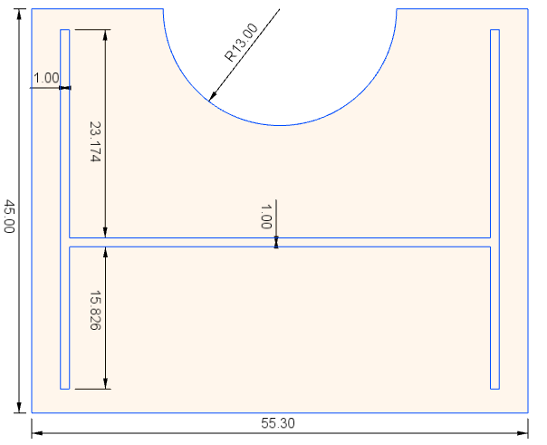
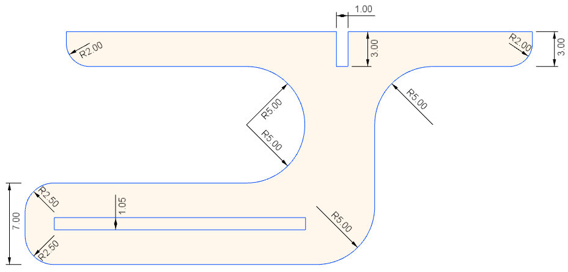
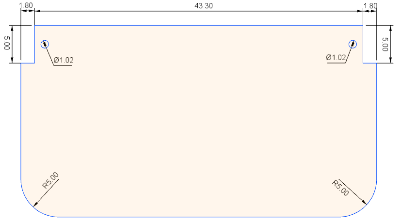
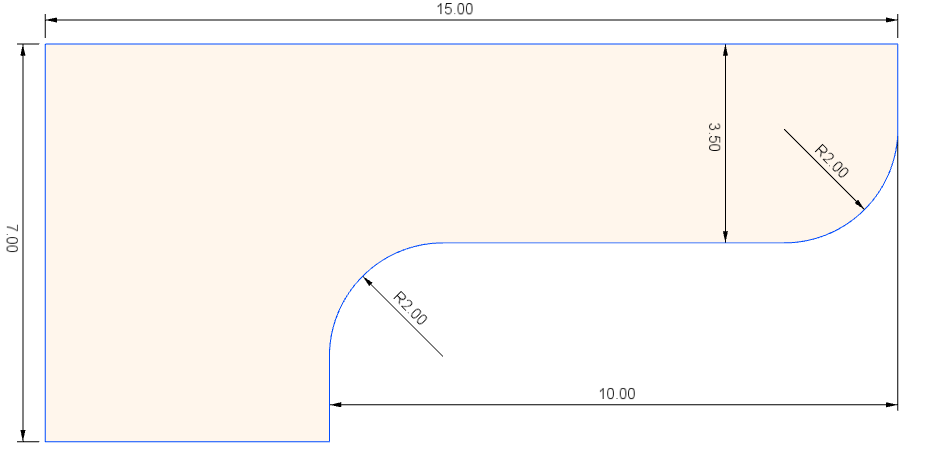
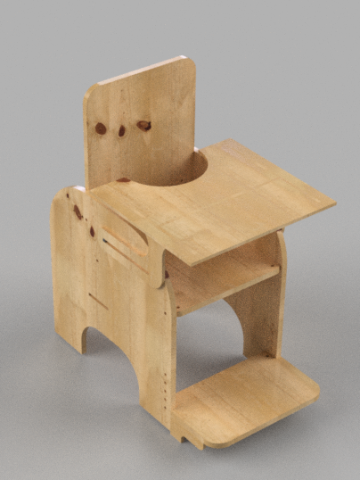

# Adaptive Chair

## Purpose
The adaptive chair is designed for people who are unable to use a normal chair for everyday purpose. The chair could be designed for people with spinal disorders, limb limitations, Cerebral Palsy, and related issues.

## Overview
People with related spinal, motor or limb issues often find it difficult to sit on a chair at a comfortable position. An adaptive chair allows users to change the height of the tray, position of the footrest, backrest and seat.

The adaptive chair can be made to suit the needs of different people by adjusting the parameters of the components before fabricating them making it customizable and easily accessible.

## Project Creation
The adaptive chair involves several components including the tray, tray holder, footrest, backrest, seat, side frames, bolts with knob to hold the components in place and adjust accordingly, a slotted angle frame to assemble the chair together, and some screws to be drilled into the components during assembly.

The dimensions for the chair can be made for an individual according to his age, size, weight etc.

The next section shows the dimension of each component and the quantity required (shown in brackets). The 3D model of the components was made using Autodesk Fusion 360.
  
## Autodesk Fusion Model of Adaptive Chair
This project requires a good knowledge of navigating Autodesk Fusion 360 and its features. Autodesk Fusion was used to construct a 3D model of the adaptive chair. To create the chair, sketches of each component were made. The dimensions of each sketch (in centimetres) are shown below

### Backrest:

### Side Frame (x2):

.png)

### Side Frame (Close-up of top half):

### Knob:

### Seat:

### Tray:

### Tray Supports (x2):

### Tray Fixture:

### Footrest:

### Footrest Support (x2):

## Assembly
After creating the sketches, the components are designed next. The seat, footrest, backrest, side frame and the knobs are extruded with a thickness of 18 mm. The rest of the components have a thickness of 10 mm.

The rendered image of the assembled Adaptive Chair is shown below:

## Fabrication
After completing the 3D model design and the assembly of the components are successful. The next step involves fabrication of the components using a Laser Cutter tool. A 6 feet by 4 feet plywood material, 18 mm thick, is placed on the Laser Cutter to cut out the components that require a thickness of 18 mm. A 3 feet by 4 feet plywood material, 10 mm thick, is also required to cut out components that have a thickness of 10 mm.

// find out fabrication process involved

// To Be Added: (write about Autodesk Fusion… design process involved… add pics of design… final assembly… add details of plywood board… add method of fabrication… observe fabrication process… take pic of fabrication… explain assembly process… take pic of assembly process step by step… pic of chair being used in NISH…  get user feedback…)
